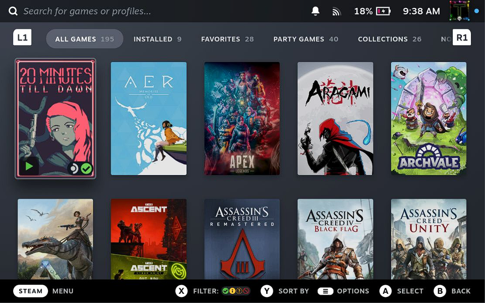

# Lock Deck

A plugin for customizing your lockscreen

<!--  -->

# Overview

Lock Deck gives you control over the layout, transitions and general styling of your Steam Deck's lockscreen.

# Features

<!-- TODO -->

# Using the plugin

Once you have installed Lock Deck, open it in the Quick Access Menu (QAM), where you can begin customizing the lockscreen!

# Installation
1. [Install the Decky plugin loader](https://github.com/SteamDeckHomebrew/decky-loader#installation)
2. Use the built in plugin store to download the Lock Deck Plugin

# Contributing

If you're interested in fixing a bug, submitting a new feature, or just helping out, please read the [Contributor Guidelines](./Contributing.md)

# Licensing
 - This program is licensed under the [GNU General Public License Version 3](https://www.gnu.org/licenses/#GPL) and [BSD 3-Clause License](https://opensource.org/license/bsd-3-clause/)  
 - Additionally, please provide appropriate credit for code usage

Copyright Travis Lane (Tormak)
